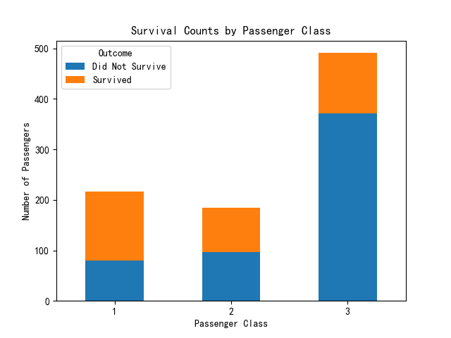

# Titanic Survival Analysis with Pandas

Analyzes the Titanic dataset using Pandas to explore survival patterns and passenger demographics.

## Dataset
- **Source**: [Titanic Dataset on Kaggle](https://www.kaggle.com/datasets/yasserh/titanic-dataset)
- **File**: `Titanic-Dataset.csv`

## Files
- **`titanic_analysis.ipynb`**: Jupyter Notebook with code, outputs, and a stacked bar plot.
- **`survival_by_class.png`**: Visualization of survival counts by passenger class.

## Analysis
- Loads and cleans data (handles nulls in `Age`, `Cabin`, `Embarked`).
- Computes overall survival rate (38.38%) and average fare (32.2).
- Groups by `Sex` (male: 18.89%, female: 74.2%) and `Pclass` (ages: 36.81, 29.77, 25.93).
- Filters for high-fare survivors (39) and young Southampton passengers (82).
- Plots survival counts by class (see `survival_by_class.png`).

## Run It
- **Requirements**: Python, Pandas, Matplotlib
- Open `titanic_analysis.ipynb` in Jupyter Notebook or run locally.

## Skills Demonstrated
- Pandas: Data cleaning, grouping, filtering.
- Matplotlib: Basic visualization.
